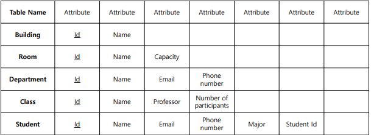
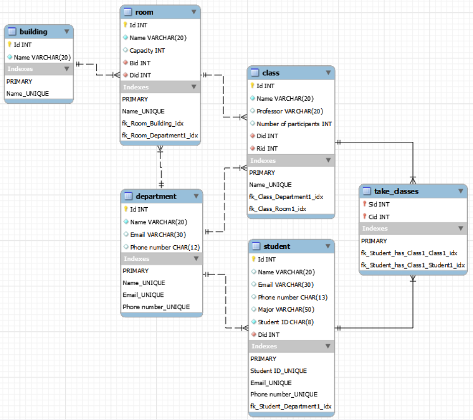

## 4주차 실습

1. 아래의 요구사항을 만족하는 Inha 데이터베이스를 만들 것.



2. Inha 데이터베이스를 workbench 상에서 그리고 화면 캡처할 것.



3. Inha 데이터베이스의 각 테이블에 5개 이상의 값을 insert 할 것.

4. 각 테이블의 설명(desc 명령어) 및 조회(select) 결과를 캡처할 것.

```sql
-- building 테이블
desc * from building;
select * from building;

-- room 테이블
desc * from room;
select * from room;

-- department 테이블
desc * from department;
select * from department;

-- class 테이블
desc * from class;
select * from class;

-- student 테이블
desc * from student;
select * from student;

-- take_classes 테이블, class 테이블과 student 테이블이 n:m 관계
desc * from take_classes;
select * from take_classes;
```
