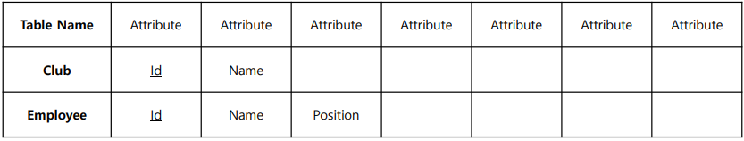
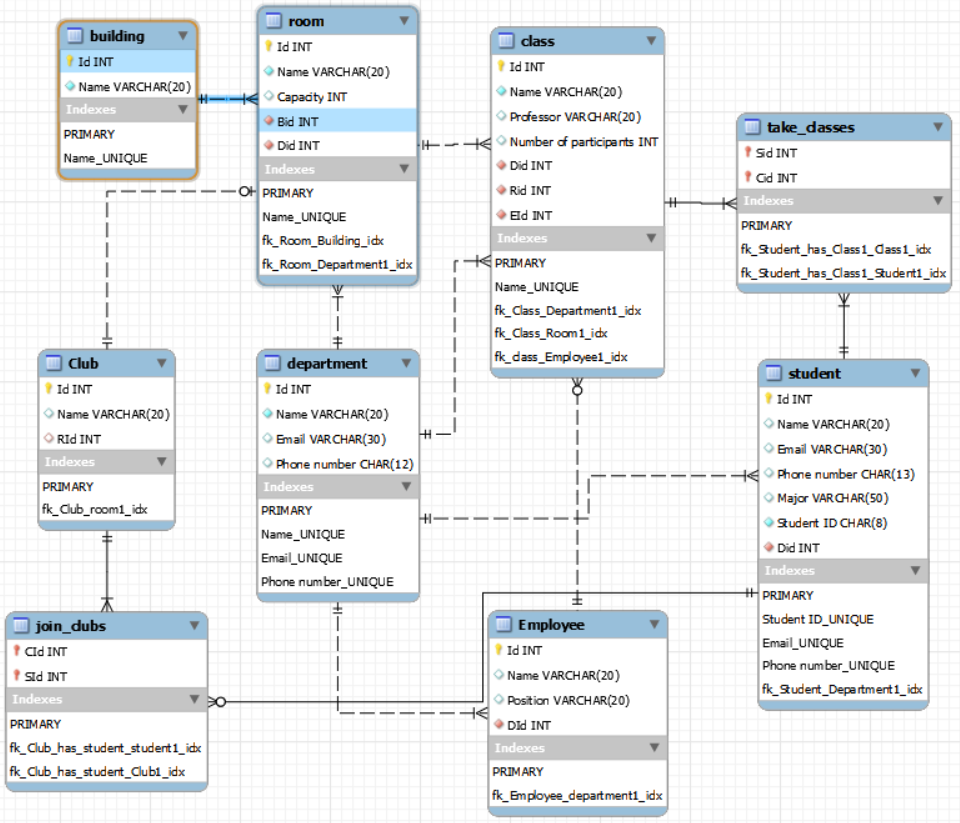
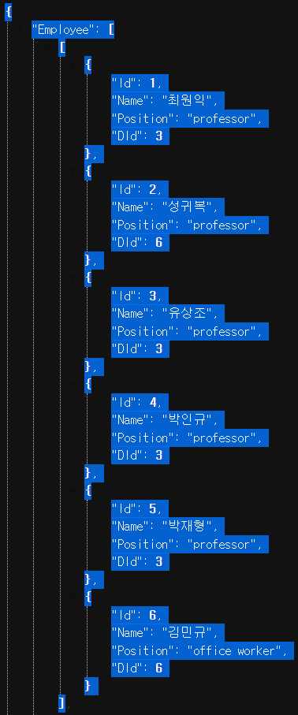

## 5주차 실습
1. 4주차 과제에서 만든 Inha 데이터베이스 확장



2. 확장한 Inha DB를 Express와 연동
```sql
-- employee 테이블 insert
insert into employee
    values  (1, '최원익', 'professor', 3),
            (2, '성귀복', 'professor', 6),
            (3, '유상조', 'professor', 3),
            (4, '박인규', 'professor', 3),
            (5, '박재형', 'professor', 3),
            (6, '김민규', 'office worker', 6);

-- employee 테이블 select
select * from employee
```


### 5주차 실습 실행 방법
1. 레포지토리 복사
> 1. git glone <원격저장소 주소>
> 2. 해당 폴더로 이동 ex) cd week5
> 3. npm init
> 4. npm install
> 5. npm run start

2. sql.js 파일 내부에서 본인의 데이터베이스 정보 입력
```javascript
const pool = mysql.createPool({
  host: "localhost",
  port: 3306,
  user: "root",
  password: "password",
  database: "week5",
});
```

### <span style="color: red">주의사항</span>
> <span style='background-color: #ffdce0'>**본인의 데이터베이스가 실습 조건을 만족하는지 확인!**</span>
