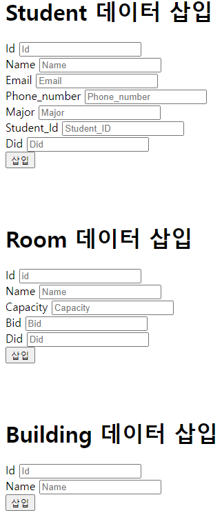

## 9주차 실습
1. 실습 내용을 바탕으로 Inha DB에 적용



2. 임의로 학생을 10만명 만들어서 index 미적용/적용 결과를 제시
[외부 sql 파일 읽기&실행(참고)](https://philip.yurchuk.com/software/mysql-failed-to-open-file-error-2-and-22-on-windows/)
```python
# week9_createindex.py
f = open('week9_step2.sql', 'w', encoding="UTF-8")
# 사용할 DB 이름
f.writelines("USE week9_assignment_12181763;\n")
```
---
```sql
source C:/Users/week9_step2.sql; 
```

### 9주차 실습 실행 방법
1. 레포지토리 복사
   > 1. git clone <원격저장소 주소>
   > 2. 해당 폴더로 이동 ex) cd week9
   > 3. npm init
   > 4. npm install
   > 5. npm run start

2. sql.js 파일 내부에서 본인의 데이터베이스 정보 입력
```javascript
// 데이터베이스 연결
const pool = mysql.createPool(
  process.env.JAWSDB_URL ?? {
    host: "localhost",
    user: "root",
    database: "week9_assignment_12181763", // DB파일
    password: "password",
    waitForConnections: true,
    connectionLimit: 10,
    queueLimit: 0,
  }
);
```

### <span style="color: red">주의사항</span>
> <span style='background-color: #ffdce0'>**본인의 데이터베이스가 실습 조건을 만족하는지 확인!**</span>
